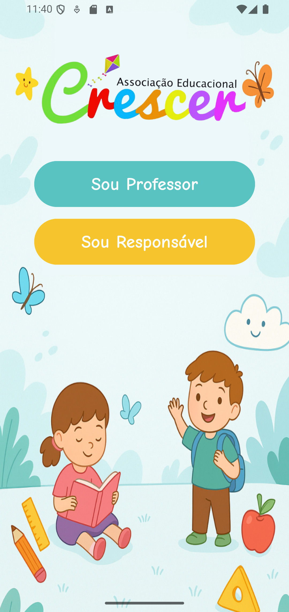
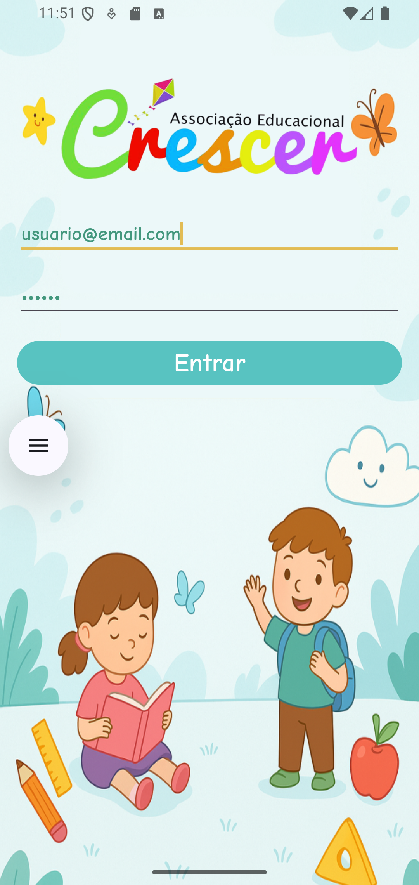
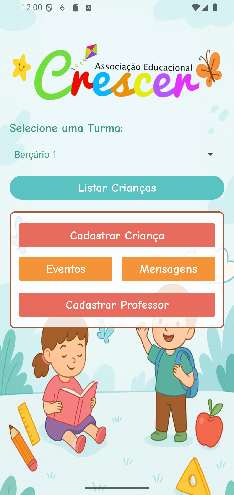
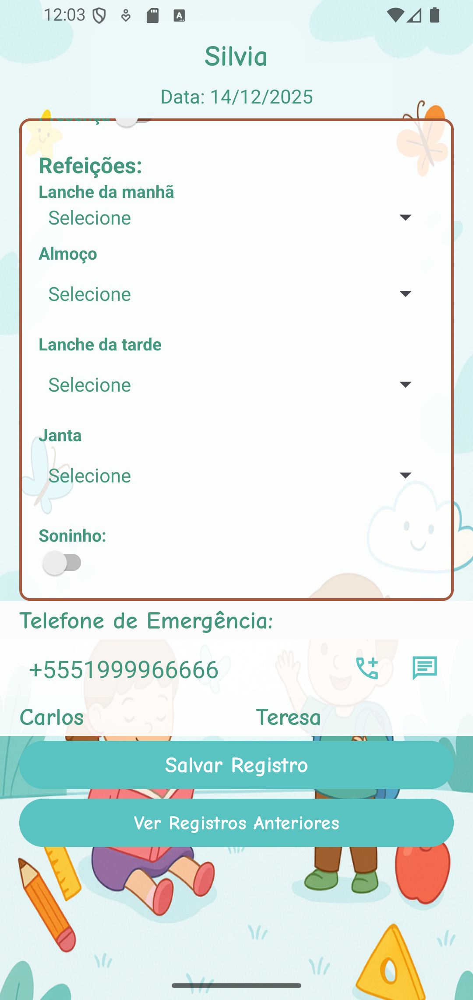

# Agenda Escolar Crescer 📘

Aplicativo Android voltado para escolas infantis, com foco na comunicação entre escola e pais, oferecendo um registro diário completo da rotina da criança.

## 📱 Funcionalidades
- Cadastro de alunos e responsáveis
- Registro diário de informações (presença, observações, refeições, soninho)
- Área dos pais com login
- Envio de notificações
- Mensagens tipo chat entre escola e responsáveis

## 🛠 Tecnologias utilizadas
- Kotlin
- Firebase (Firestore e Storage)
- RecyclerView
- ViewBinding
- Consumo de APIs REST

## 📸 Screenshots

  
  
  
  
  

## 📚 Principais aprendizados
- Integração com Firebase Authentication e Firestore
- Organização de fluxos de navegação no Android
- Boas práticas com RecyclerView e ViewBinding

## 🚀 Status do projeto
🚧 Em desenvolvimento — novas funcionalidades estão sendo adicionadas continuamente.
